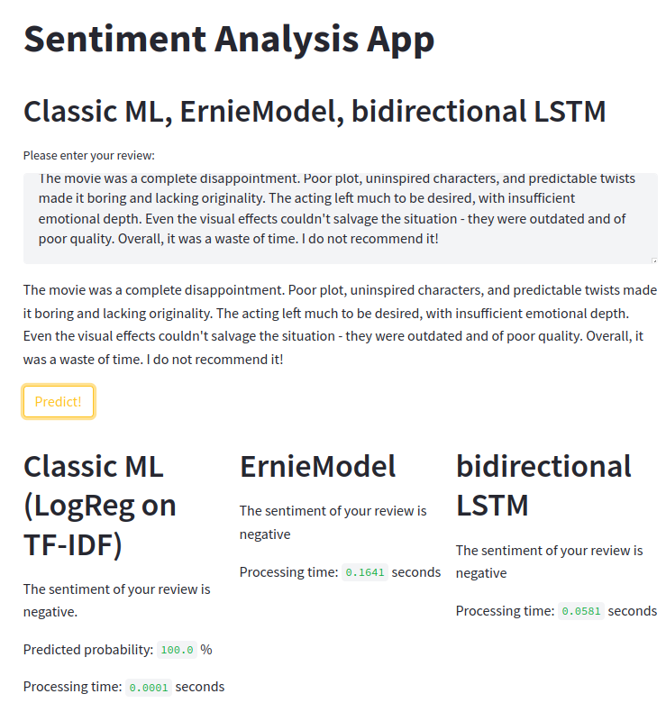
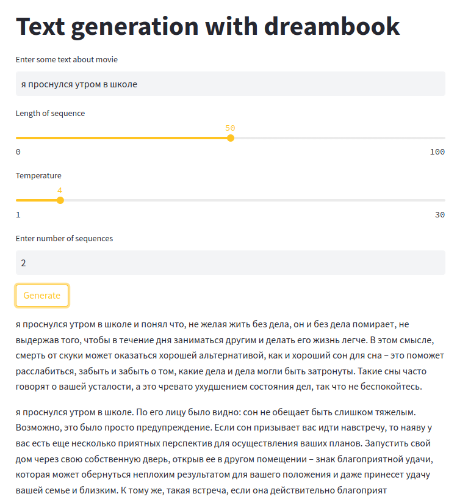

# :open_book: nlp_project 

**Natural Language Processing with ML, LSTM, BERT, GPT **

[Multipage-приложение с использованием streamlit](https://huggingface.co/spaces/IvaElen/nlp_proj) 
  * Классификация отзыва на фильм на английском языке. Сравнение результатов предсказаний класса (позитивный/негативный) тремя моделями: 
    - Классический ML-алгоритм, обученный на TF-IDF представлении 
    - bidirectional LSTM модель 
    - [ERNIE 2.0](https://huggingface.co/nghuyong/ernie-2.0-base-en) 

 * Генерация текста GPT-моделью по пользовательскому prompt. Модель [tinkoff-ai/ruDialoGPT-small](https://huggingface.co/tinkoff-ai/ruDialoGPT-small) дообучили на текстах книги толкования слов. Реализованы возможности выбора длины генерируемого текста, температуры (градуса "абсурдности"), количества генерируемых текстов.

**Примеры работы  **

## GPT team: 
[IvaElen](https://github.com/IvaElen) - классификация отзывов с помощью  ERNIE 2.0, дообучение, создание фичей для генерации текста GPT-моделью, деплой приложения на huggingface  
[GalkaMT](https://github.com/GalkaMT) - классификация отзывов bidirectional LSTM моделью, создание общего приложения, оформление репозитория< 
[AlexeyPratsevityi](https://github.com/AlexeyPratsevityi) -классификация отзывов с помощью модели логистической регрессии,обученной на TF-IDF представлении, создание общего приложения  

**Ссылка на репозиторий на [huggingface](https://huggingface.co/spaces/IvaElen/nlp_proj/tree/main)  **
**Стэк:** PyTorch, Pandas, NumPy, scikit-learn, streamlit, Natural Language Toolkit (NLTK)
